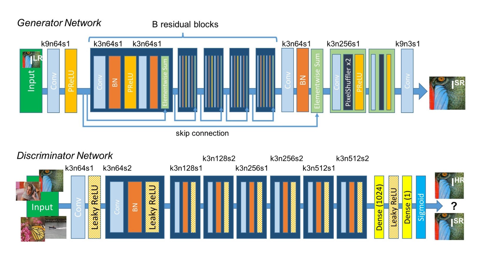

# Image-Resolution-Enhancement-using-GANs
The obejective of this project is to take a low resolution images and tries to generate a high resolution images which looks as realistic as possible. This is achieved by using GANs.


## Table of contents
* [General info](#general-info)
* [Project Structure](#project_str)
* [Dataset](#data)
* [Project Execution Steps](#project)
* [Result Similar Images](#similar)
* [Conclusion](#conclusion)
* [Future Work](#future)

<a name="general-info"></a>
## General info

Generative adversarial networks (GANs) have found many applications in Deep Learning. One interesting problem that can be better solved using GANs is to improve the quality of the images. The task objective is upscaling images from low-resolution sizes into high-resolution sizes.Thereby we will use the concept of SRGANs or Super Resolution GANs.

We define the training procedure in the following steps:

- We process the HR(High Resolution) images to get down-sampled LR(Low Resolution) images. Now we have both HR and LR images for training data set.
- We pass LR images through Generator which up-samples and gives SR(Super Resolution) images.
- We use a discriminator to distinguish the HR images and back-propagate the GAN loss to train the discriminator and the generator.


<div style="text-align: center"></div>


<a name="project_str"></a>
## Project Structure

The entire project structure is as follows:
```
├── data
│   └── srgan.jpg
├── models
├── src
│   └── super_resolution_gan.py
├── test
├── utils
│   └── utils.py
├── README.md
├── network_param.py
└── train.py
```

As we see from the project structure :

a) all the class related to generator and discriminator are kept in **src** folder. 

b)All the utils function like loading the data from dirs, defining residual blocks , up sampling blocks are kept in utils.py of the utils folder

c) All the network parameters like loading a VGG19 model, defining a gan loss , defining conversion of hr and lr images are defined in *network_param.py* file


d) The features extraction script is in **index.py** file
